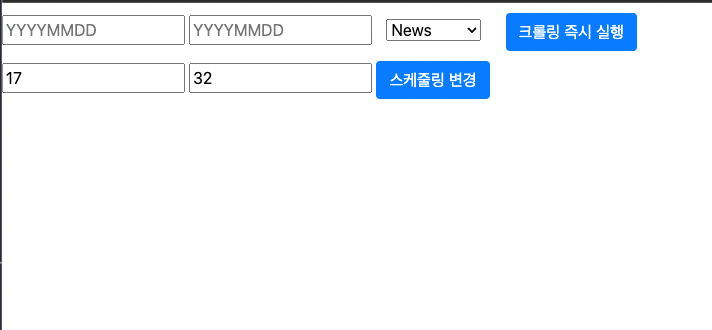

# SKKU_YGE_COOP
SKKU &amp; YGEntertainment COOP


## Docker, Celery 연동 확인 하는 법

### 1. Docker image 빌드하기
```
$ docker build -t sentimental-analysis .
```

(x86_64 아키텍쳐가 아니거나 linux가 아닌 환경에서는 아래의 명령어를 작성해주세요)
```
$ docker build --platform linux/x86_64 sentimental-analysis .
```
참고로 빌드 시간이 상당히 오래걸릴 수 있습니다.

### 2. 이미지 기반으로 compose 진행하기
```
$ docker-compose up -d
```

### 3. 스케줄 시간 바꾸기
현재는 스케줄 시간이 6시, 18시로 고정되어 있어 테스트로 확인하기 굉장히 번거러운 상황입니다.
이를 위해서 웹페이지를 따로 마련하여 해당 페이지에서 스케줄 정보를 변경할 수 있게 해놨습니다.

compose 이후  **yg-sentimental-analysis** 가 실행된 것을 확인되면, localhost:80/crawler 페이지에서 스케줄 시간을 변경할 수 있습니다. (compose 이후 마이그레이션 때문에 시간이 다소 오래걸릴 수 있습니다.)


사진에서 두번째 줄 부분에서 시간, 분을 입력한 뒤 변경 버튼을 누르면 스케줄 시간을 바꿀 수 있습니다.


## py-hansepll pip 설치시 오류

requirements.txt에 따라 설치할 때 py-hanspell 설치 오류가 발생하면 아래의 방법을 사용하시길 바랍니다.

1. py-hanspell clone - 적당한 곳에 clone 진행(프로젝트을 실행시킨 가상환경이 켜져있는 터미널로 진행하세요)


```
$ git clone https://github.com/ssut/py-hanspell
```

2. clone 된 프로젝트 폴더로 이동해 

```
$ python setup.py install
```

3. 설치 확인 - py-hanspell 이 있는지 확인
```
$ pip freeze
```


위 과정으로 진행하면 hanspell을 설치 할 수 있습니다.

[출처] - https://hasiki.tistory.com/71


